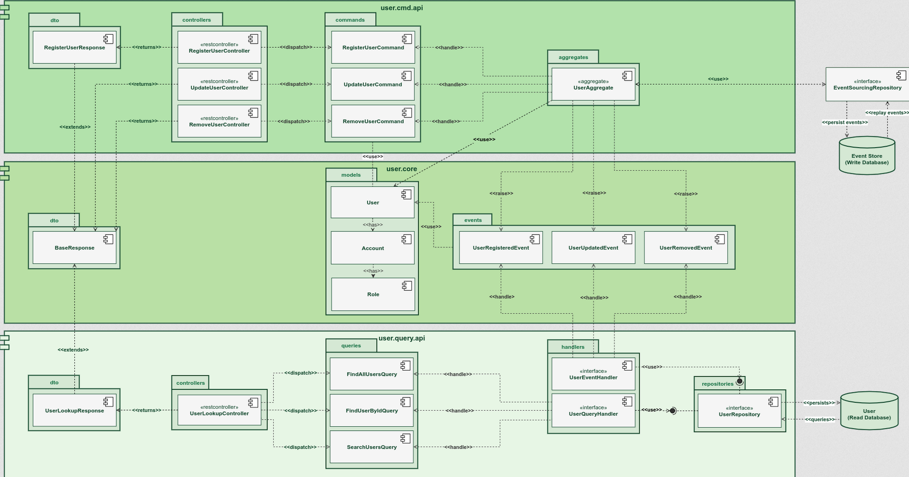

This project is based on https://www.udemy.com/course/master-spring-boot-microservices-with-cqrs-event-sourcing course

The requirements for this application to run are:

### Create Docker Network - springbankNet

docker network create --attachable -d overlay springbankNet

### Axon Platform

Run in Docker:
docker run -d --name axon-server \
-p 8024:8024 -p 8124:8124 \
--network springbankNet \
--restart always axoniq/axonserver:latest

Once installed, check if running:
http://localhost:8024/

### MongoDB

Run in Docker:
docker run -it -d --name mongo-container \
-p 27017:27017 --network springbankNet \
--restart always \
-v mongodb_data_container:/data/db \
mongo:latest

Download Client Tools – Robo 3T:
https://robomongo.org/download

### MySQL

Run in Docker:
docker run -it -d --name mysql-container \
-p 3306:3306 --network springbankNet \
-e MYSQL_ROOT_PASSWORD=springbankRootPsw \
--restart always \
-v mysql_data_container:/var/lib/mysql  \
mysql:latest

first time you ran the application make use to uncomment the //@Component from the Bootstrap class on user.cmd.api project
this will allow you to have at least one user to start and play with. 
If it fails for any reason try to comment the @PreAuthorize("hasAuthority('WRITE_PRIVILEGE')") from RegisterUserController

This is the flow of the application

