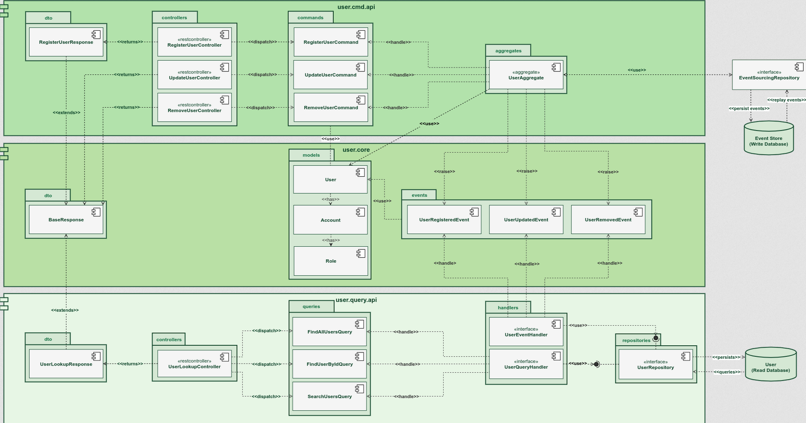
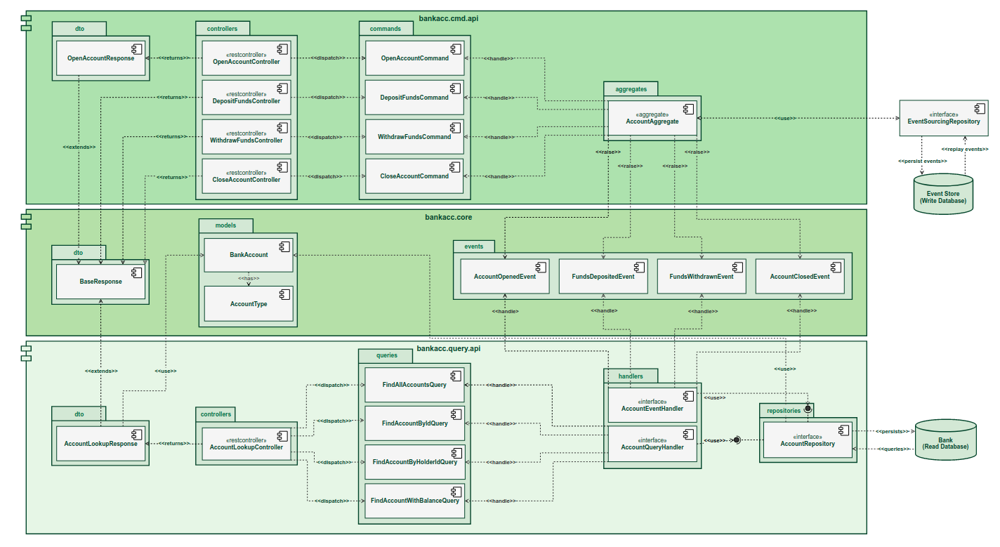

This project is based on https://www.udemy.com/course/master-spring-boot-microservices-with-cqrs-event-sourcing course

The requirements for this application to run are:

### Create Docker Network - springbankNet

docker network create --attachable -d overlay springbankNet

### Axon Platform

Run in Docker:
docker run -d --name axon-server \
-p 8024:8024 -p 8124:8124 \
--network springbankNet \
--restart always axoniq/axonserver:latest

Once installed, check if running:
http://localhost:8024/

### MongoDB

Run in Docker:
docker run -it -d --name mongo-container \
-p 27017:27017 --network springbankNet \
--restart always \
-v mongodb_data_container:/data/db \
mongo:latest

Download Client Tools – Robo 3T:
https://robomongo.org/download

### MySQL

Run in Docker:
docker run -it -d --name mysql-container \
-p 3306:3306 --network springbankNet \
-e MYSQL_ROOT_PASSWORD=springbankRootPsw \
--restart always \
-v mysql_data_container:/var/lib/mysql  \
mysql:latest

If you want to run the project locally without docker.compose (docker/springbank/docker-compose.yml) and start mysql-container,
axon-server and mongo-container, then execute a mvn clean install, then you can run the application 
(probably will need to comment the @Component from the bootstrap class on user-cmd-api, as it will create a user every time you start the server)

# Run application using docker

If you want to run the project using docker, first execute a mvn clean install -DskipTests (skipTests would be required here because it will try to connect into the databases that are not up yet)

Run your containers:

```$ docker-compose up```
OR
```$ docker-compose up --build  --force-recreate```

Check all containers are up and running:

```$ docker ps```

For stopping our stack:

```$ docker-compose stop```

if you try to execute "generate Oauth Token" postman call and you face an error, go to user.cmd.api, and execute:
```$ mvn clean install```

this is required in case of the user-cmd-api starts before mongo-container is up.

#Architecture of the application

This is the flow of the user microservices


This is the flow of the bank account microservices



